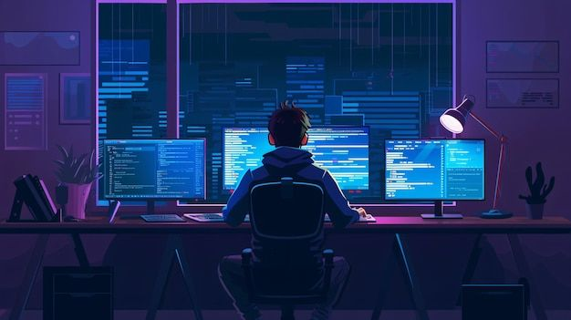

# Hi, I'm Ahmad Shahzad

  

## About Me

Passionate **AI & Web Developer**
I build intelligent apps with **AI, Deep Learning, NLP**, and **Web Technologies** using Python, MERN stack, and more.

When not coding, I explore AI projects, experiment with new frameworks, and contribute to my GitHub portfolio.

## My Journey

* Learning Python, Artificial Intelligence, Deep Learning (TensorFlow/Keras), NLP, and Computer Vision
* Building portfolio projects: Login Systems, Netflix Clone, Task Boards, and E-commerce templates
* Currently exploring advanced AI models and web integrations

## Current Position

* Student at **University of Agriculture Peshawar**, pursuing BS in Artificial Intelligence (2023–2027)

## Tech Stack

## Featured Projects

* **[Netflix Clone](https://github.com/Ahmadshahzad1424/netflix_clone)**
  A front-end HTML/CSS project replicating Netflix layout
* **[MegaStore](https://github.com/Ahmadshahzad1424/megastore)**
  E-commerce front-end template built with HTML & CSS
* **[Task Board](https://github.com/Ahmadshahzad1424/Task_Board)**
  Task management board to organize projects and workflows

## My Socials

  
